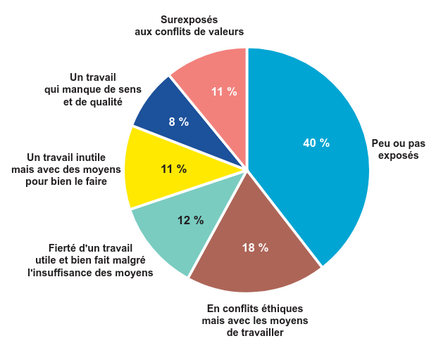

---
documentclass: extarticle
fontsize: 12pt
pagestyle: empty
---

**Weber Loïc IDIA4**

# Les valeurs éthiques des ingénieurs dans les organisations

# Les Remerciements

# Introduction

Historiquement, la notion de valeur était biologique, associée à la survie humaine. Avec l'apparition de la monnaie, elle est devenue un capital (terres, or…). 
Puis, dans l'économie de marché, elle s'est largement financiarisée, perdant une grande partie de son lien avec l'humain.
Aujourd'hui, bien qu'encore financières, les valeurs retrouvent une dimension humaine, devenant également culturelles, morales, éthiques, sociales et environnementales. Cette ré-humanisation des valeurs s'inscrit historiquement après de nombreux événements emblématiques où les valeurs éthiques ont été négligées au profit de la réussite financière, militaire ou technique.

Parmi ces événements, on retrouve le cas de Monsanto, une entreprise dont la réputation a été gravement ternie par des accusations d'écocide de par la vente de l'Agent Orange à l'armée américaine pendant la guerre du Vietnam.
Les ingénieurs de Monsanto, ainsi que d'autres entreprises chimiques, savaient que l'Agent Orange était toxique mais ont continué à le produire et à le fournir à l'armée américaine.
Les conséquences de ces actions ont été dévastatrices pour l'environnement et la santé des populations locale, causant des maladies graves et des malformations qui ont fait 3 millions de victimes direct et indirect et a conduit à de nombreuses plaintes contre Monsanto et d'autres entreprises impliquées.

On peut aussi citer le Projet Manhattan lors de la Seconde Guerre mondiale, dirigé par Robert Oppenheimer, qui a conduit au développement de la bombe atomique. Après les bombardements d'Hiroshima et de Nagasaki, de nombreux scientifiques, y compris Oppenheimer, ont exprimé des remords et des dilemmes éthiques concernant leur participation à ce projet.

Ces événements soulèvent d'importantes questions sur la responsabilité éthique des ingénieurs et des organisations.

En tant que futur ingénieur, je ressens souvent une forme de tension entre mes valeurs et la réalité du monde du travail.
Certaines perspectives de carrière, comme celles proposées dans la finance ou l’assurance, me semblent complètement contradictoires avec mes valeurs.
Mais pour avoir beaucoup discuté avec d'autres ingénieurs, je sais que ce sentiment n'est pas partagé par tous.

L’exemple des ingénieurs d’AgroParisTech, qui ont publiquement exprimé leur désaccord avec les valeurs de certaines industries, me touche personnellement.
Ces jeunes ingénieurs, tout juste sortis de l'école, refusent de se soumettre à une logique purement économique ou industrielle au détriment de l’éthique.

Actuellement alternant ingénieur Platform, mon métier consiste à construire une plateforme de développement pour les ingénieurs développeurs.
Dans cette mission, je suis donc responsable du bon fonctionnement et de l'amélioration continue des outils de travail de ces ingénieurs, afin d'augmenter la vélocité à laquelle ils créent et déploient de nouvelles fonctionnalités à nos clients.
J'occupe ce rôle au sein de l'entreprise iAdvize.

iAdvize est un éditeur de logiciel (SAAS) de taille moyenne (~150 employés).
Elle occupe une place importante dans l'écosystème du E-commerce européen. Avec des clients dans une dizaine de pays, elle a pour objectif de révolutionner l'expérience d'achat en ligne en y intégrant une dimension conversationnelle.

iAdvize, comme toute entreprise moderne, possède des valeurs.

Mais quelles sont ces valeurs et comment s'articulent-elles autour des valeurs éthiques individuelles des ingénieurs qui conçoivent les systèmes que iAdvize vend ?

Ainsi nous tenterons de répondre a la problématique suivante :

Quelles sont les valeurs éthiques des ingénieurs et quelle est leur place dans les organisations dans lesquelles ils travaillent ?

A partir de cette problématique, nous axerons notre mémoire sur les hypothèses suivantes :

- Les ingénieurs ont besoin d'associer les objectifs de leur entreprise à des valeurs éthiques pour éviter un sentiment d'aliénation au travail.

- Soucieux des enjeux écologiques et sociaux actuels, les jeunes ingénieurs tendent à se détourner de certains secteurs pour privilégier des organisations qui tentent de répondre concrètement aux problématiques actuelles et qui mettent l'humain au coeur de leur démarche.

- Les ingénieurs ont le besoin d'être tenu dans un cadre éthique pour éviter que leurs créations techniques ne soient détournées à des fins contraires à l'intérêt général.

# Développement

TODO: Poser le fond du contexte d'étude et amenée la problematique

## Problématique

Quelles sont les valeurs éthiques des ingénieurs et quelle est leur place dans les organisations dans lesquelles ils travaillent ?

TODO: Définition des concepts de la problématique

## Hypothèses

- Les ingénieurs ont besoin d'associer les objectifs de leur entreprise à des valeurs éthiques pour éviter un sentiment d'aliénation au travail.

- Soucieux des enjeux écologiques et sociaux actuels, les jeunes ingénieurs tendent à se détourner de certains secteurs pour privilégier des organisations qui tentent de répondre concrètement aux problématiques actuelles et qui mettent l'humain au coeur de leur démarche.

- Les ingénieurs ont le besoin d'être tenu dans un cadre éthique pour éviter que leurs créations techniques ne soient détournées à des fins contraires à l'intérêt général.

## Le Plan d'action (Protocole de recherche)

Dans l'objectifs de récolter des données qualitatif et quantitative afin d'infirmer, de réfuter ou de nuancer nos hypothèses, nous utiliserons deux méthodes :

### La grille de questionnaire pour les entretiens informelle

Sur la base de la grille de questionnaire suivante : 

Hypothèse 1 : 
> Les ingénieurs ont le besoin d'être tenu dans un cadre éthique pour éviter que leurs créations techniques ne soient détournées à des fins contraires à l'intérêt général.

Question 1.1 :
- Est-ce qu’il y a des parties de ton travail que tu trouverais impossibles à expliquer a des gens non technique ? Si oui, pourquoi ? Et est-ce que ça te pose un problème ?

Rebond 1 : 
- Si oui => Si personne ne comprends a part toi ou un groupe restreint de personnes, n'est ce pas dangereux éthiquement parlant ? Comment tu en parles démocratiquement avec d'autre personnes ?
- Si non => Comment tu fais pour formaliser les concepts / implémentation très technique ?

Objectifs 1 : 
- Évaluer si la personne perçoit une différence entre le langage technique et le langage commun.
- Identifier si elle a conscience des limites de la traduction.
- Observer si elle relie cette difficulté à des risques éthiques.
     
Question 1.2 : 
- Est-ce que tu as déjà travaillais sur un système sur lequels tu ne maitrisais par tous les impacts éthique (sociaux, politiques, environnementaux)

Rebond 1.2 :
- Si oui => Est-ce que tu as chercher a prendre du recul sur ces impacts ?
- Si non => Comment tu fais pour t'assurer que les systemes que tu conçois sont éthiques ?

Objectifs 1.2 : 
- Savoir si la personne a déjà été confrontée à une dissonance entre son travail technique et ses implications.
- Comprendre ses mécanismes de responsabilité (ex. : revues éthiques, discussions en équipe, auto-censure).
- Comprendre si la personne pense aux impacts des systemes quelle crée et surtout si elle se questionne sur les enjeux éthiques des solutions quelle conçoit.
     
Question 1.3 :
- Est-ce que tu te sens protégé par le cadre éthique de ton entreprise lors de la création de systeme technique ? Par exemple, si tu avais un doute sur les conséquences d’un système que tu développes, est-ce que tu saurais à qui t’adresser ou comment agir ? 

Objectifs 1.3 :  
- Savoir si l’ingénieur se sent soutenu par son entreprise quand des dilemmes éthiques surgissent.
- Identifier si des mécanismes concrets existent ou si c’est flou/inexistant.
- Comprendre si la personne a déjà été confrontée à des situations où l’éthique était en tension avec les objectifs techniques ou commerciaux.

Hypothèse 2 :

> Les ingénieurs ont besoin d'associer les objectifs de leur entreprise à des valeurs éthiques pour éviter un sentiment d'aliénation au travail.

Question 2.1 :
- Quand tu regardes les projets sur lesquels tu travailles ou les objectifs de ton entreprise, est-ce que tu as l’impression qu’ils s’alignent avec tes valeurs éthiques personnelles ?  

Rebond 2.1 :
- Si oui => Est ce que tu a choisis ces missions / entreprise pour cette raison ? => comment tu fais si demain on te propose un travail qui n'est pas alignée avec tes valeurs ?
- Si non => Est ce que cela te pose probleme pour travailler ? si oui quelles problèmes ? Ou bien arrives tu a faire abstraction ? et si oui comment ?
     
Objectifs 2.1 :  
- Identifier le niveau d’alignement valeurs/entreprise et surtout s'il existent une injonction des valeur et comment ils réagissent

Question 2.2 :
- Est-ce que tu as une vision claire de l'utilité sociale ou collective de ce que tu produis ? 
- Si tu devais expliquer à un proche à quoi et a qui sert ton travail, comment tu le formulerais ?

Rebonds 2.2 :
- Si c'est floue => Est-ce que ce manque de visibilité sur l'utilité de ton travail te dérange ? Ou bien tu te concentre uniquement sur la partie techniques ?
- Si la réponse est précise => Est-ce que cette clarté sur l'utilité t'aide à te motiver au quotidien ? Ou est-ce que tu as déjà douté, même sur des projets qui devraient avoir du sens ?

Objectifs 2.2 :
- Savoir si l'ingénieur perçoit son travail comme un moyen ou une fin
- Identifier si le manque de visibilité sur l'impact génère de la frustration
- Révéler des mécanismes de défense contre le sentiment d'alinéation

### Recherche d'études, témoignages, articles en ligne 

- Bibliothèque numérique du Cairn
- Témoignages vidéo d'ingénieurs militant 
- Site gouvernementaux
- Article Le Monde, france inter...

## Situations étudiée

TODO: les évolutions du sujet

## Le concept d'éthique

### L'éthique au sein d'une organisation

L'éthique est un ensemble de principes moraux qui constitue une base pour la conduite humaine, incluant des aspects sociaux, environnementaux, humains, animale et spirituels.

Dans le contexte de l'entreprise, l'éthique correspond à l'application de ces principes à la conduite des affaires. Cela englobe toutes les décisions et comportements discrétionnaires non réglementés.

Les valeurs éthiques d'une organisation sont choisies par des individus ayant chacun leurs propres valeurs. Ensemble, ils déterminent les valeurs que l'organisation doit promouvoir et celles sur lesquelles ses actions doivent se concentrer.

« Le sujet de l'éthique d'entreprise n'est plus une mode pour le management, mais bien un mode de management. » - *Ethique, responsabilité et stratégie d'entreprise*, Orse.

Observer les valeurs éthiques d'une entreprise permet de mettre en évidence ses points forts ainsi que sa direction générale.

Ces valeurs définissent de manière sous-jacente les croyances, les principes et la culture interne de l'organisation. Elles influencent également fortement son image externe.

> Réfléchir à la notion de valeur en entreprise permet de rendre compte des atouts et attraits de l'entreprise au présent, mais aussi et surtout de rassurer les employés, managers et investisseurs sur sa pérennité.

- "Tendances économiques et sociales de la valeur en entreprise" de Valérie Lejeune

#### Comment sont trouvées les valeurs éthiques dans une organisation ?

Les valeurs éthiques d'une entreprise sont généralement le fruit d'un équilibre entre des facteurs internes et externes.

Elles reflètent à la fois les convictions personnelles des dirigeants, les attentes des employés et les pressions externes exercées sur l'entreprise.

Parmi les pressions externes on notera :

- Les lois et politiques publiques, telles que la loi PACTE du 22 mai 2019 ou encore du plan France 2030 relative à la croissance et la transformation des entreprises qui ambitionne de donner aux entreprises les moyens d'innover, de se transformer, de grandir et de créer des emplois, favorisant une vision stratégique à long terme.

- Les évolutions sociétales et les attentes des consommateurs pour des pratiques durables jouent un rôle central dans la définition et l'adoption de ces valeurs.

- Les investisseurs de plus en plus soucieux de critères environnementaux, sociaux et de gouvernance (ESG), influencent également les choix des organisations.

- Le recrutement de nouveaux employés : Les candidats, notamment parmi les jeunes générations, accordent une importance croissante à l'éthique, à la diversité et à l'impact sociétal des organisations. Cette tendance pousse les entreprises à adapter et promouvoir leurs valeurs éthiques pour répondre aux attentes des talents qu'elles souhaitent intégrer.

TODO: AJOUTER la théorie des valeurs prenantes

#### La hiérarchie des valeurs chez iAdvize

iAdvize possède 4 valeurs :

1. Fun as a must have (bonheur au travail)

2. Committed for better (inclusion, égalité au travail)

3. Entrepreneur Spirit (encourage l'autonomie, la flexibilité et l'initiative)

4. Learning organization (encourage l'apprentissage et le développement personnel des employés)

Voici l'ordre dans lequel ces valeurs sont présentées sur le site Internet d'iAdvize. Depuis un an et demi que je suis chez iAdvize, j'ai pu voir le rayonnement de toutes ces valeurs. Officiellement, ce sont les 4 valeurs d'iAdvize, mais dans les faits, l'entreprise s'engage également sur d'autres terrains, comme par exemple l'écologie, publiquement ou en interne. L'environnement est une valeur forte chez iAdvize, avec une dizaine d'affiches dans les bureaux et l'opération "Fresque du climat" qui est un temps de 3 heures que tous les employés de l'entreprise ont suivi.

TODO: MONTRER QUE DANS LE CAS d'iAdvize, la théorie des valeurs prenantes ne marche pas quand on regarde uniquement les valeurs publique de iAdvize => il existe d'autre valeurs moins mise en avant

### L'éthique au sein de l'individu

L'éthique de l'ingénieur ne se limite pas à un ensemble de règles morales personnel. Chaque ingénieur est d’abord un citoyen responsable, qui relie les sciences, les technologies et la communauté humaine. C’est ce que rappelle la Charte d’éthique de l’ingénieur publiée par l’IESF : 

> l’ingénieur doit inscrire ses actes dans une démarche de développement durable, faire prendre conscience de l’impact de la technique sur l’environnement et mettre ses compétences au service du bien commun.

Cette charte, considérée comme une profession de foi pour les ingénieurs et scientifique de france, reconnaît que le progrès technique n’est pas neutre. (comme vu avec le projet manhattan) Les avancées qu’il apporte à la société peuvent être porteuses de risques et de nuisances si elles ne sont pas encadrées par une réflexion éthique puisque inventé le train c'est aussi inventé le deraillement !
Les ingénieurs ont un rôle essentiel et double : maîtriser les technologies au service de la communauté humaine et diffuser une information claire sur leurs limites, leurs risques et leurs avantages

#### L'injonction de valeurs au travail

En 2016 la Dares poste une étude sur 22 895 actifs révélant que six actifs occupés sur dix signalent être exposés à des conflits de valeurs dans leur travail.
La plus fréquente concerne deux actifs occupés sur dix, qui vivent des **conflits éthiques car ils doivent faire des choses qu’ils désapprouvent**, même si par ailleurs ils ont les moyens de bien faire leur travail.
Les autres situations touchent chacune un actif occupé sur dix.
Certains doivent faire un travail qu’ils jugent en grande partie inutile, ce à quoi s’ajoute, pour d’autres, l’absence de fierté du travail bien fait.
D’autres encore estiment manquer de moyens pour bien faire leur travail mais se sentent malgré tout fiers du résultat.
Le dernier cas concerne les personnes qui cumulent la plupart des conflits de valeur.
Les salariés les plus exposés aux conflits de valeurs et à leur cumul déclarent plus fréquemment une santé physique et mentale dégradée.

> voir fig 1 en annexes

Si maintenant on s'intéresse aux informaticiens dans cette étude, on remarque que **les techniciens de l’informatique** sont associés à deux profils opposés : 
- d’un engagement fort entravé par le manque de moyens.
- soit d’un désengagement par perte de sens et de qualité malgré des conditions matérielles correctes.  

De même, **les ingénieurs en informatique** apparaissent dans la catégorie de ceux qui **ressentent leur travail comme peu utile**, **ce qui révèle un sentiment de déconnexion entre les tâches réalisées et leur finalité perçue**.
Malgré des conditions matérielles souvent adéquates (outils informatiques, collègues disponibles, autonomie), ces cadres peuvent souffrir de frustration liée à l’absence de reconnaissance ou au manque d’impact perçu.
L'étude de la Dares montre alors que ces tensions les exposent à des risques accru de troubles du sommeil, de stress et de baisse du bien-être psychologique, surtout lorsqu’ils se retrouvent dans des situations où la qualité doit être sacrifiée ou lorsque leur utilité sociale semble floue.

TODO: APPUYER AVEC DES ENTRETIENS

#### L'importance d'un cadre éthique pour les ingénieurs

> Une des raisons profondes de notre incapacité à comprendre est liée, selon Hannah Arendt, à l'usage d'un "langage" de symboles mathématiques. Au début, écrit-elle, cet usage avait pour but de simplifier la communication en concevant des abréviations pour des propositions d'énoncés formulables par la parole. Il "contient à présent des propositions absolument intraduisibles dans le langage" (Arendt, 1961/1958 : 3). Ainsi, si les scientifiques n'ont pas refusé de développer des armes nucléaires, ce n'est pas d'abord, selon elle, par manque de caractère ou de courage ou encore par naïveté, parce qu'"ils n'auraient pas compris qu'une fois ces armes inventées, ils seraient les derniers consultés sur leur emploi". Ils n'ont pas refusé de poursuivre leur recherche parce qu'"ils évoluaient dans un monde où le langage a perdu son pouvoir. Et toute action de l'homme, tout savoir, toute expérience n'a de sens que dans la mesure où l'on peut en parler".

- "Figure inspirante pour la formation en éthique des ingénieurs" de Christelle Didier

Ici, on peut voir de manière flagrante une analogie avec les langages de programmation, qui, comme le langage mathématique, contiennent des propositions intraduisibles dans le langage. Exemple extrait du noyau Linux (projet open source qui constitue la base de l'extrême majorité des systèmes d'exploitation utilisés, notamment les serveurs, les appareils mobiles et les systèmes embarqués) :

```C
BPF_CALL_3(bpf_probe_read_compat_str, void *, dst, u32, size,
   const void *, unsafe_ptr)
{
  if ((unsigned long)unsafe_ptr < TASK_SIZE) {
    return bpf_probe_read_user_str_common(dst, size,
      (__force void __user *)unsafe_ptr);
  }
  return bpf_probe_read_kernel_str_common(dst, size, unsafe_ptr);
}
```

Ainsi, l'ingénieur informaticien peut se retrouver concepteur d'un système dont il ne peut comprendre pleinement les conséquences car il évolue dans un monde où le langage a perdu son pouvoir. Cela souligne l'importance d'un cadre éthique pour les ingénieurs en informatique, car ils peuvent créer des systèmes complexes sans toujours comprendre les implications éthiques de leur travail.

Et ce problème est toujours d'actualité avec plus récemment les majeurs avancée dans le développement des algorithmes d'apprentissage automatique utilisés notamment dans la reconnaissance faciale ou les systèmes de recommandation. Ces systèmes peuvent avoir des implications sociales et politiques considérables, comme la surveillance de masse ou encore la propagation de fausses informations... 

TODO: Comparé cette théorie avec le terrain (entretien)

# Conclusion et ouverture

TODO: Reintroduire problématique
TODO: Passé sur ce qui a était dit et sur quelles hypothèse ont était vérifier et celle non
TODO: Ouvrir sur les potentiels autre sujet qui sur lequelles on aurait pu faire un micro mémaoire
TODO: + les trucs que je me suis dit que j'aurais pus faire pour avoir + de matière mais que j'ai pas fait

# Annexes / Table des figures

<div style="text-align: center;">
    
    <br>
    <strong>fig 1. Répartition des actifs occupés selon leur profil
d’exposition aux conflits de valeurs</strong>
    <br>
    <em>enquête CT-RPS 2016, Dares, DGAFP, Drees et Insee.</em>
</div>

TODO: PREUVE D'entretiens informelles

# Bibliographie

- Valérie Lejeune - *Tendances économiques et sociales de la valeur en entreprise*
- Julia de Funes - *La comédie (in)humaine*
- Orse - *Ethique, responsabilité et stratégie d'entreprise*
- Christelle Didier - *Hannah Arendt, figure inspirante pour la formation en éthique des ingénieurs*

- [Inventer le train c'est inventer le deraillement](https://www.lemonde.fr/vous/article/2009/01/15/paul-virilio-penser-la-vitesse_1142442_3238.html)

- [Proces de l'agent orange pour Monsanto](https://lareleveetlapeste.fr/proces-de-lagent-orange-monsanto-et-lagro-chimie-devant-la-justice/)

- [Charte éthique de l'ingénieur par la société des ingénieurs et scientifiques de france](https://www.iesf.fr/offres/doc_inline_src/752/150731_Charte_ethique.pdf)

* [« Je ne sais pas combien sont ces ingénieurs qui doutent, mais mon expérience me laisse penser qu'ils sont de plus en plus nombreux » - Le Monde](https://www.lemonde.fr/campus/article/2023/06/19/je-ne-sais-pas-combien-sont-ces-ingenieurs-qui-doutent-mais-mon-experience-me-laisse-penser-qu-ils-sont-de-plus-en-plus-nombreux_6178318_4401467.html)

* [Les bifurqueurs : ces étudiants ingénieurs qui poussent leur école à s'adapter à l'urgence climatique - France Info](https://www.radiofrance.fr/franceinfo/podcasts/les-documents-franceinfo/les-bifurqueurs-ces-etudiants-ingenieurs-qui-poussent-leur-ecole-a-s-adapter-a-l-urgence-climatique-2776641)

* [Le plan France 2030](https://www.entreprises.gouv.fr/priorites-et-actions/transition-numerique/soutenir-le-developpement-de-lia-au-service-de-leconomie)

* [Discours d'un ingénieur qui doute - Emilien Chevalier](https://www.youtube.com/watch?v=OoUwfJuwPX8)

* [Discours d'un collectif d'ingénieurs diplômés d'AgroParisTech](https://www.youtube.com/watch?v=SUOVOC2Kd50)

* [Discours Remise des Diplômes 2018 Centrale Nantes](https://www.youtube.com/watch?v=3LvTgiWSAAE)

* [Etude femmes chez accenture](https://sightsinplus.com/news/industry-news/accenture-achieved-46-women-in-its-workforce-aiming-50-by-2025/)

* [Les entreprises qui abandonne la politique de DEI](https://www.business-world.fr/entreprises-aux-etats-unis-qui-ont-abandonne-leurs-objectifs-de-diversite-dequite-et-dinclusion/)

* [Etude de la Dares sur les conflits de valeurs au travails et leurs risques sur la santé](https://dares.travail-emploi.gouv.fr/publication/conflits-de-valeurs-au-travail-qui-est-concerne-et-quels-liens-avec-la-sante)

# Retour personnel sur le module SSAT

# Ce qu'il faut retenir (résumé en 15 lignes)

